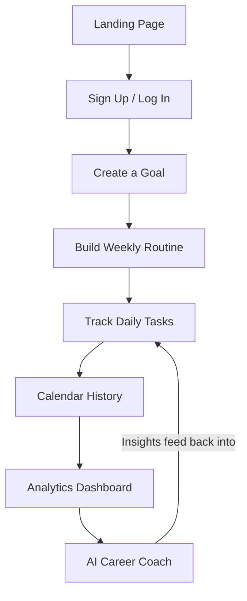
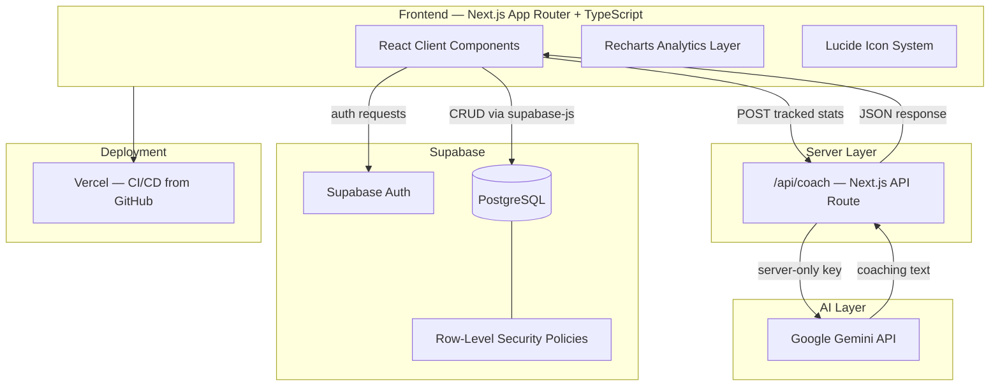
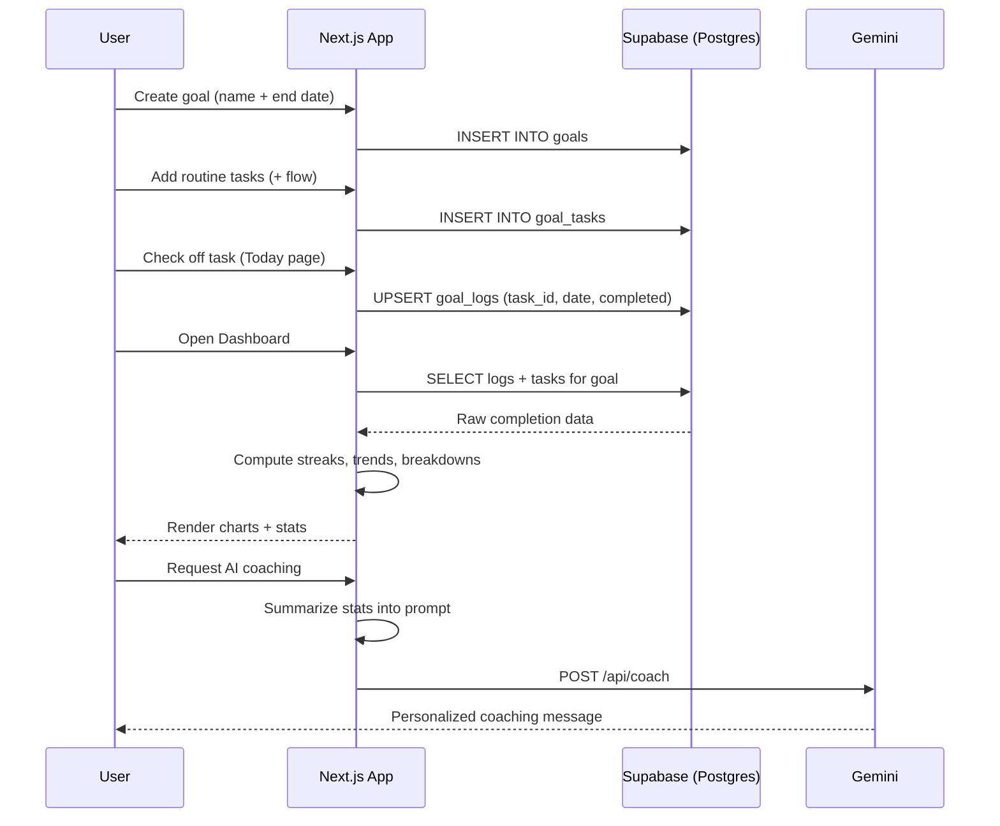
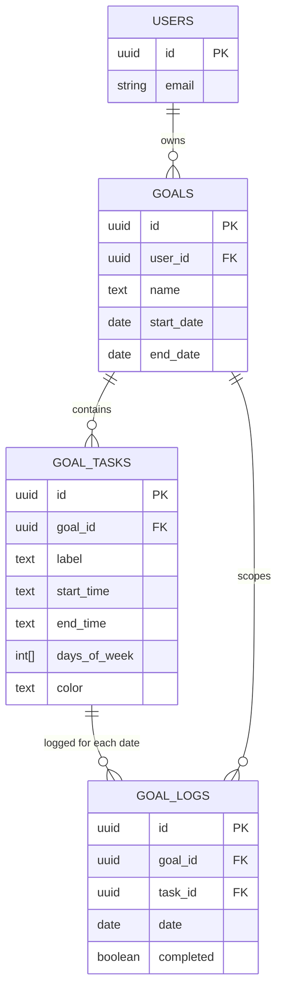

<div align="center">

# 🚀 Let's Crack It

### Turn any goal into a daily system. Track consistency. Visualize progress. Build habits that actually stick.

A full-stack, multi-tenant goal and habit-tracking platform — built with Next.js, TypeScript, and Supabase, with an AI career coach that reads your real tracked data and tells you exactly where to focus.

<br/>

[](https://nextjs.org/)
[](https://react.dev/)
[](https://www.typescriptlang.org/)
[](https://tailwindcss.com/)
[](https://supabase.com/)
[](https://vercel.com/)
[](https://ai.google.dev/)
[](./LICENSE)

<br/>

[](https://github.com/Abhirup2728/lets-crack-it/stargazers)
[](https://github.com/Abhirup2728/lets-crack-it/commits/main)
[](https://github.com/Abhirup2728/lets-crack-it/issues)
[](https://github.com/Abhirup2728/lets-crack-it)


<br/>

**[🌐 Live Demo](https://lets-crack-it-abhirup2728.vercel.app)** &nbsp;·&nbsp;
**[📦 Repository](https://github.com/Abhirup2728/lets-crack-it)** &nbsp;·&nbsp;
**[🐛 Report Bug](https://github.com/Abhirup2728/lets-crack-it/issues)** &nbsp;·&nbsp;
**[✨ Request Feature](https://github.com/Abhirup2728/lets-crack-it/issues)**

</div>

<br/>

> 📝 **Note:** Replace the live-demo URL above with your final production Vercel domain if it differs, and swap the screenshot placeholders below with real captures before publishing.

---

## 📸 Project Preview

<div align="center">

| Landing Page | Login / Sign Up |
|:---:|:---:|
| _Hero section, feature grid, and call-to-action_ | _Email/password auth via Supabase_ |
| `<!-- screenshot: landing.png -->` | `<!-- screenshot: login.png -->` |

| Goals Dashboard | Weekly Routine Builder |
|:---:|:---:|
| _Create, edit, and delete goals_ | _Design a recurring weekly schedule per goal_ |
| `<!-- screenshot: goals.png -->` | `<!-- screenshot: routine-builder.png -->` |

| Today — Daily Tracker | Calendar History |
|:---:|:---:|
| _Live "happening now" indicator, countdown, daily quote_ | _Month-by-month calendar, color-coded by completion_ |
| `<!-- screenshot: today.png -->` | `<!-- screenshot: history.png -->` |

| Analytics Dashboard | AI Career Coach |
|:---:|:---:|
| _Streaks, trends, task-wise & weekday/weekend breakdowns_ | _Personalized coaching generated from real tracked data_ |
| `<!-- screenshot: dashboard.png -->` | `<!-- screenshot: ai-coach.png -->` |

</div>

---

## 💡 About The Project

Most habit trackers assume everyone's day looks the same. **Let's Crack It** doesn't.

It was built around a simple idea: **any long-term goal — an exam, a job search, a fitness plan, a creative project — succeeds or fails based on whether the daily system behind it actually gets followed.** Motivation is unreliable. A visible, honest record of what you actually did each day is not.

Instead of a fixed checklist, every user designs their **own weekly-recurring routine** — different tasks for different days, with time ranges, that repeat automatically from the moment they're created. The app then tracks completion daily, visualizes it across weeks and months, and closes the loop with an **AI coach that reads the user's real performance data** and tells them, specifically, what to fix.

**Core philosophy:** consistency over motivation, data over guesswork, and a system flexible enough to work for a CAT aspirant, a job seeker, or someone training for a marathon — all using the exact same underlying engine.

---

## ✨ Features

<details open>
<summary><strong>🔐 Authentication</strong></summary>

- Secure email/password authentication via Supabase Auth
- Session persistence across page reloads
- Protected routes — unauthenticated users are redirected to login
- Per-user data isolation enforced at the database level (Row-Level Security)

</details>

<details open>
<summary><strong>🎯 Goal Management</strong></summary>

- Create unlimited goals, each with its own name and target end date
- Edit a goal's name or deadline at any time without losing history
- Delete a goal (cascades cleanly to its routine and logs)
- Multiple goals run independently and in parallel

</details>

<details open>
<summary><strong>🗓️ Weekly Routine Builder</strong></summary>

- Add tasks one at a time via a simple "+" flow
- Assign each task a start time and end time
- Assign each task to specific days of the week (Mon–Fri, weekends only, every day, or any custom combination)
- Full edit support — change a task's name, time, or days without deleting and recreating it
- Color-coded task categories for instant visual recognition

</details>

<details open>
<summary><strong>✅ Daily Tracker</strong></summary>

- One-tap checkbox completion for every task scheduled that day
- Tasks sorted chronologically by start time, morning to night
- **Live "happening now" indicator** — the task matching the current real-world clock time is visually highlighted with a pulsing badge
- A live countdown to midnight showing exactly how much of the day remains
- Days-remaining countdown to the goal's target deadline
- A rotating daily motivational quote
- Full-day completion percentage, updated in real time

</details>

<details open>
<summary><strong>📅 Calendar History</strong></summary>

- Month-by-month visual calendar for the full span of a goal
- Each month rendered in a distinct color band for quick orientation
- Past and present days are color-coded by completion percentage
- Clicking a past/today date opens a full day-level breakdown (donut chart, stats, task checklist)
- Clicking a **future** date opens a read-only preview of what's scheduled that day — a genuine forward-looking to-do view, not just a locked cell

</details>

<details open>
<summary><strong>📊 Analytics Dashboard</strong></summary>

- Summary stat cards: average completion, last-7-day average, last-30-day average, current streak, longest streak, perfect days
- Weekly trend line chart alongside a cumulative "overall growth" line
- Monthly completion bar chart
- Task-wise completion breakdown (horizontal bar chart)
- Weekday vs. weekend comparison chart
- Effort distribution pie chart across task categories
- Rule-based coaching suggestions generated purely from the user's own logged data (streak status, trend direction, weakest/strongest task, weekday/weekend gaps)

</details>

<details open>
<summary><strong>🤖 AI Career Coach</strong></summary>

- On-demand, personalized coaching message generated via the Google Gemini API
- Prompt is built from the user's real computed stats — streaks, per-task completion rates, weekday/weekend split, and the last 10 logged days
- Runs through a server-side Next.js API route, keeping the AI key private and never exposed to the browser
- Designed to synthesize insight, not repeat raw numbers — identifies the single highest-leverage thing to focus on next

</details>

<details open>
<summary><strong>🎨 User Experience</strong></summary>

- Fully responsive layout across desktop, tablet, and mobile
- Consistent gradient-and-card design language throughout
- Pill-style tab navigation between Today / History / Dashboard
- Centered, prominent goal name shown above every section so multi-goal users always know where they are
- Professional iconography (Lucide) instead of generic emoji
- Global footer with social links present on every page

</details>

---

## 🔄 How It Works



---

## 🏗️ Application Architecture



---

## 🧬 Goal Tracking Lifecycle



---

## 🛠️ Tech Stack

<table>
<tr><td valign="top" width="50%">

**Frontend**
| Technology | Purpose |
|---|---|
| Next.js (App Router) | React framework, routing, API routes |
| TypeScript | Static typing across the codebase |
| Tailwind CSS | Utility-first styling |
| Recharts | Charts — line, bar, pie |
| Lucide React | Icon system |

</td><td valign="top" width="50%">

**Backend & Data**
| Technology | Purpose |
|---|---|
| Supabase (PostgreSQL) | Primary database |
| Supabase Auth | Email/password authentication |
| Row-Level Security | Per-user data isolation |
| Next.js API Routes | Server-side AI proxy |

</td></tr>
<tr><td valign="top" width="50%">

**AI**
| Technology | Purpose |
|---|---|
| Google Gemini API | Personalized coaching generation |
| `@google/generative-ai` SDK | Server-side model calls |

</td><td valign="top" width="50%">

**Tooling & Deployment**
| Technology | Purpose |
|---|---|
| Vercel | Hosting, CI/CD from GitHub |
| Git & GitHub | Version control |
| npm | Package management |
| ESLint | Code linting |

</td></tr>
</table>

---

## 📁 Project Structure

```
lets-crack-it/
├── app/
│   ├── page.tsx                  # Public landing page
│   ├── layout.tsx                # Root layout, global footer, fonts
│   ├── globals.css               # Tailwind entry + light-mode enforcement
│   ├── login/
│   │   └── page.tsx              # Auth: login + signup
│   ├── goals/
│   │   ├── page.tsx              # Goal list, create/edit/delete
│   │   └── [id]/
│   │       ├── setup/page.tsx    # Weekly routine builder (add/edit/delete tasks)
│   │       ├── today/page.tsx    # Daily tracker + live "now" indicator
│   │       ├── history/
│   │       │   ├── page.tsx      # Calendar view
│   │       │   └── [date]/page.tsx  # Day-level detail (past) / preview (future)
│   │       └── dashboard/page.tsx   # Analytics + AI coach
│   └── api/
│       └── coach/route.ts        # Server-side Gemini API proxy
├── components/
│   ├── NavTabs.tsx                # Today / History / Dashboard pill nav
│   └── DayCountdown.tsx           # Live midnight countdown
├── lib/
│   ├── supabase.ts                # Supabase client init
│   ├── goals.ts                   # Types, formatters, date helpers
│   └── quotes.ts                  # Rotating daily quotes
└── .env.local                     # Environment variables (not committed)
```

---

## 🗄️ Data Model



**Design decision:** rather than a fixed schema tied to one specific routine (e.g. hardcoded "morning study" / "evening study" columns), the schema is fully normalized — `goals`, `goal_tasks`, and `goal_logs` are decoupled, so the exact same three tables serve any goal type, any routine shape, for any number of users, without a single line of app code caring what the tasks are actually called.

Every table has Row-Level Security enabled with policies scoped through `auth.uid()`, so a user can only ever read or write rows belonging to their own goals — enforced at the database layer, not just in application code.

---

## 🧠 AI Career Coach — How It Works

1. The Dashboard computes real derived metrics client-side: overall/7-day/30-day averages, current & longest streaks, per-task completion rates, and weekday-vs-weekend split.
2. On request, this structured summary (not raw log rows) is POSTed to a server-side API route.
3. The API route builds a detailed prompt instructing the model to act as a direct, specific accountability coach — acknowledge something real from the data, identify the single highest-leverage focus area, give concrete actions, and close with honest (not generic) encouragement.
4. The Gemini API key lives only in a server-only environment variable — never bundled into client-side JavaScript.
5. The generated message is returned as JSON and rendered directly in the dashboard.

**Future direction:** deeper trend analysis across multiple goals simultaneously, and scheduled (rather than on-demand) weekly coaching summaries.

---

## 📈 Analytics Engine — What's Actually Calculated

| Metric | Calculation |
|---|---|
| Daily completion % | (tasks completed ÷ tasks scheduled that day) × 100 |
| Current streak | Consecutive 100%-complete days ending yesterday |
| Longest streak | Maximum consecutive 100%-complete run in history |
| Weekly average | Mean daily completion, grouped by ISO week (Monday start) |
| Cumulative growth | Running average of weekly averages over time |
| Weekday vs. weekend | Daily completions split by day-of-week, averaged separately |
| Task-wise rate | Per task: completions ÷ times scheduled, across the full date range |
| Effort distribution | Share of total completed checks attributable to each task category |

All of it is derived client-side from raw `goal_logs` rows — no pre-aggregated tables, so the numbers are always exact and live.

---

## 🎨 UI/UX Design Philosophy

- **Card-based, gradient-accented** — every functional block lives in its own rounded card; color gradients (indigo → purple, emerald → teal, rose → orange) distinguish sections at a glance
- **Category color-coding** — every task type has a consistent color across the Today checklist, History detail view, and Dashboard charts, so the same color always means the same thing
- **Minimal cognitive load** — the Today page answers one question the instant it loads: *what should I be doing right now?*
- **Mobile-first responsiveness** — grid layouts collapse gracefully from multi-column desktop views to single-column mobile stacks
- **Professional iconography** — Lucide icons throughout, deliberately avoiding emoji-as-UI-element outside of the quote/motivational copy

---

## 🔐 Security

- Supabase Auth handles credential storage and session management — no custom password handling
- Row-Level Security policies enforced on every table (`goals`, `goal_tasks`, `goal_logs`), scoped to `auth.uid()`
- AI API key stored as a server-only environment variable, accessed exclusively inside a Next.js API route
- All environment variables excluded from version control via `.gitignore`
- Protected client routes redirect unauthenticated users to `/login`

---

## ⚙️ Installation

```bash
# Clone the repository
git clone https://github.com/Abhirup2728/lets-crack-it.git
cd lets-crack-it

# Install dependencies
npm install

# Set up environment variables (see below)
cp .env.example .env.local

# Run the development server
npm run dev
```

Visit `http://localhost:3000`.

---

## 🔑 Environment Variables

Create a `.env.local` file in the project root:

```env
# Supabase — public, safe for client-side use
NEXT_PUBLIC_SUPABASE_URL=your_supabase_project_url
NEXT_PUBLIC_SUPABASE_ANON_KEY=your_supabase_anon_or_publishable_key

# Gemini — server-only, never exposed to the client
GEMINI_API_KEY=your_gemini_api_key
```

| Variable | Description |
|---|---|
| `NEXT_PUBLIC_SUPABASE_URL` | Your Supabase project's REST API base URL |
| `NEXT_PUBLIC_SUPABASE_ANON_KEY` | Public anon/publishable key — safe for browser exposure, access controlled via RLS |
| `GEMINI_API_KEY` | Google AI Studio API key — **must not** be prefixed with `NEXT_PUBLIC_` |

---

## 📜 Available Scripts

| Script | Description |
|---|---|
| `npm run dev` | Start the local development server (Turbopack) |
| `npm run build` | Create a production build |
| `npm run start` | Serve the production build |
| `npm run lint` | Run ESLint across the project |

---

## 🚀 Deployment

Deployed on **Vercel**, connected directly to this GitHub repository for automatic redeployment on every push to `main`.

1. Import the repository into Vercel
2. Add the three environment variables listed above under **Settings → Environment Variables**
3. Deploy
4. Update Supabase **Authentication → URL Configuration → Site URL** to match the production domain

---

## 🗺️ Roadmap

- [x] Email/password authentication with protected routes
- [x] Multi-goal support
- [x] Weekly-recurring routine builder
- [x] Editable tasks (time, days, name)
- [x] Daily tracker with live checkboxes
- [x] Live "happening now" task indicator
- [x] Daily countdown to midnight
- [x] Countdown to goal deadline
- [x] Rotating daily motivational quotes
- [x] Full calendar history view, color-coded by month
- [x] Day-level detail view (past days)
- [x] Read-only future-day schedule preview
- [x] Analytics dashboard (streaks, trends, monthly, task-wise)
- [x] Weekday vs. weekend comparison chart
- [x] Effort distribution pie chart
- [x] Rule-based coaching suggestions
- [x] AI-powered personalized coaching (Gemini)
- [x] Goal editing (name, deadline)
- [x] Goal deletion with cascading cleanup
- [x] Responsive mobile layout
- [x] Public landing/marketing page
- [ ] Push/email reminders for unlogged days
- [ ] Data export (CSV)
- [ ] Per-day notes/journal field
- [ ] Weekly reflection prompts
- [ ] Routine templates (exam prep, fitness, job search)
- [ ] Shareable progress cards
- [ ] Dark mode
- [ ] Progressive Web App / offline support
- [ ] Google Calendar sync
- [ ] Habit heatmap view
- [ ] Multi-goal combined overview page
- [ ] Scheduled (not just on-demand) AI weekly summaries

---

## 🤝 Contributing

Contributions are welcome.

1. Fork the repository
2. Create a feature branch (`git checkout -b feature/your-feature`)
3. Commit your changes (`git commit -m "Add: your feature"`)
4. Push to your branch (`git push origin feature/your-feature`)
5. Open a Pull Request

Please open an issue first for major changes to discuss what you'd like to change.

---

## ❓ FAQ

<details>
<summary><strong>What is Let's Crack It?</strong></summary>
A multi-user platform for turning any personal goal into a trackable daily routine, with analytics and AI-driven coaching built on top of your real progress data.
</details>

<details>
<summary><strong>Can I create unlimited goals?</strong></summary>
Yes — each goal has its own independent routine, calendar, and analytics.
</details>

<details>
<summary><strong>Do different days need the same tasks?</strong></summary>
No. Each task is assigned to specific days of the week when it's created, so weekdays and weekends (or any custom combination) can look completely different.
</details>

<details>
<summary><strong>How does the analytics dashboard calculate streaks?</strong></summary>
A streak counts consecutive days where 100% of that day's scheduled tasks were completed, ending at the most recent fully-elapsed day.
</details>

<details>
<summary><strong>Is my data private from other users?</strong></summary>
Yes — Supabase Row-Level Security policies restrict every table so a user can only ever access their own goals, tasks, and logs.
</details>

<details>
<summary><strong>How does the AI coach generate its message?</strong></summary>
It receives a structured summary of your actual computed stats (streaks, per-task rates, weekday/weekend split, recent days) and generates a message via the Gemini API through a server-side route — your raw data never leaves your account, only the aggregated summary is sent.
</details>

<details>
<summary><strong>Can I edit a routine after I've already started tracking it?</strong></summary>
Yes — task edits update in place without breaking previously logged history for that task.
</details>

<details>
<summary><strong>What happens if I click a future date on the calendar?</strong></summary>
You get a read-only preview of exactly what's scheduled that day — useful for planning ahead — but nothing is checkable until the day actually arrives.
</details>

<details>
<summary><strong>Can I self-host this?</strong></summary>
Yes — it's a standard Next.js app deployable anywhere that supports it, with your own Supabase project and Gemini API key.
</details>

<details>
<summary><strong>Is this free to run?</strong></summary>
Yes — Supabase's free tier, Vercel's free tier, and Gemini's free API tier are all sufficient for personal or small-scale use.
</details>

---

## 📄 License

Distributed under the **MIT License**. See `LICENSE` for details.

---

## 🙏 Acknowledgements

- [Next.js](https://nextjs.org/) — the React framework this app is built on
- [Supabase](https://supabase.com/) — database, auth, and Row-Level Security
- [Tailwind CSS](https://tailwindcss.com/) — styling system
- [Recharts](https://recharts.org/) — analytics visualizations
- [Lucide](https://lucide.dev/) — icon system
- [Google Gemini](https://ai.google.dev/) — AI coaching layer
- [Vercel](https://vercel.com/) — hosting and deployment

---

<div align="center">

## 👨‍💻 About the Developer

**Abhirup Gumtya**
B.Tech CSE (AI & ML) · Full-Stack & AI Engineer · Kolkata, India

Building end-to-end products across full-stack web development, applied machine learning, and RAG-based AI systems.

[](https://github.com/Abhirup2728)
[](https://www.linkedin.com/in/abhirupgumtya)
[](https://abhirup-gumtya-portfolio.netlify.app/)

<br/>

### ⭐ If this project helped you, consider giving it a star

Made with focus, iteration, and way too many late-night debugging sessions by **Abhirup Gumtya**

</div>
